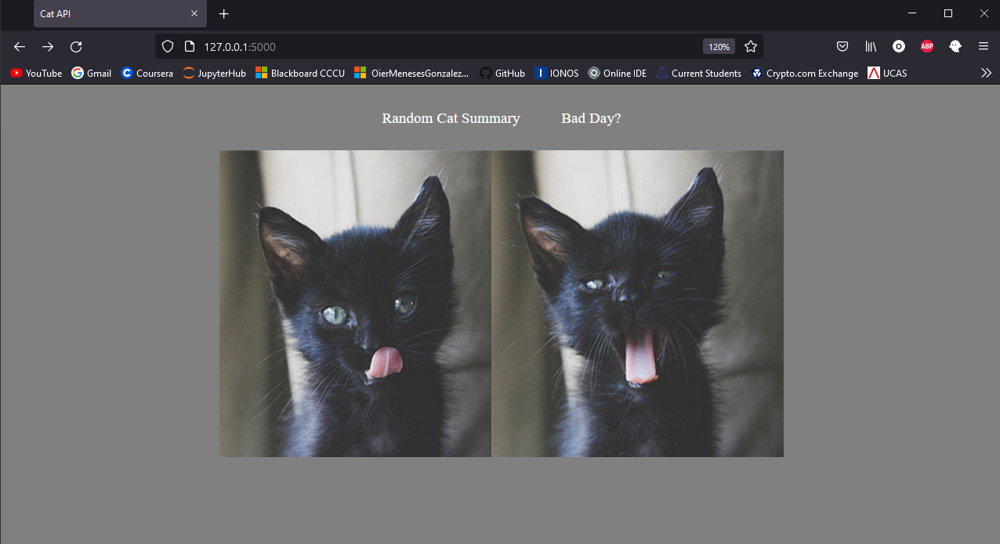

# CatAPI-TechnicalTest

I had alot of fun with this challenge. It started in the morning with little to no ideas but during an 8 hour shift at work is when the ideas really started flowing. Its 1-2 hours work and I wanted both a factual and playful part of the task. My initial idea was for the user to cycle through the gifs and have the option to send it to a coworker/friend via email. But decided the latter as there would be a little more work with the request data.
After considering carrying the task out in JavaScript (most likely the easiest way) or C# (considering its the main language used at ClearBank) I decided to work with Python and Flask, firstly, because I am most comfotable using the Python language and second, I believe more could could be completed in the short amount of time in a Python environment.

# Landing page 
Simple navigation with a random image from TheCatAPI library

# Informative page
From the data retrieved some key data was extracted

# Mood booster
Cycles through cat gifs at users request

